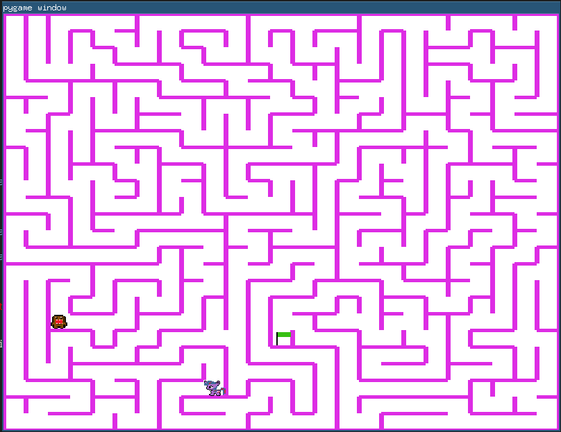

# Save the pony

Help save the pony from the terrible Domokun!

Bring the pony to the green flag in the labyrinth to save it!

## Requirements

The application has been made to run on Python 3.6 and above.

To install the dependancies, run (preferably in a virtualenv):

    pip install -r requirements.txt

## Usage

	python3 main.py

Use the **arrow keys** to navigate through the maze and the **escape** key to exit.

Some settings can be adjusted in the file `config.py`.

## Screenshot

## Possible improvements

An autosolved version could be made to automatically detect the path to take to
reach the end, but is there a more rewarding way than having a direct input to
help our pony friend exit this maze?

## Graphics justifications

It felt mandatory to use a pink labyrinth and the current font when working with
ponies.
